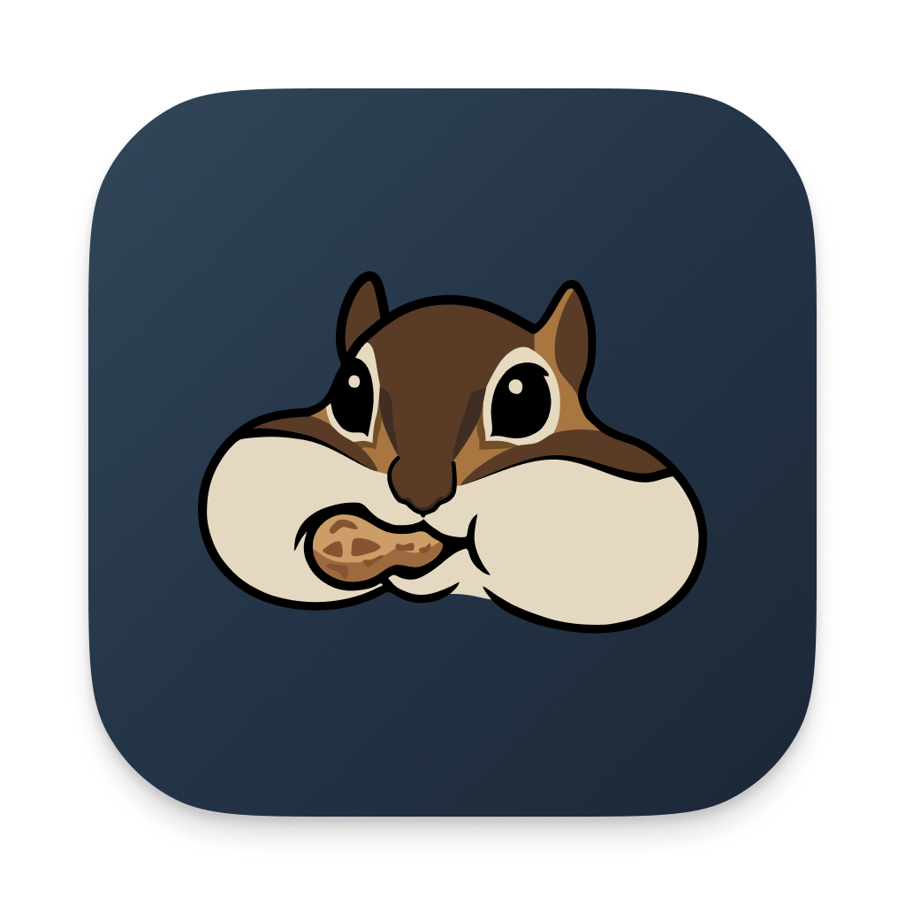
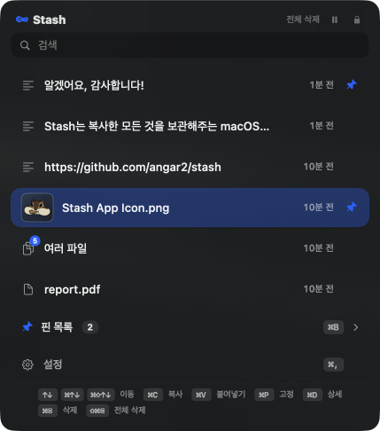

# Stash <picture><source media="(prefers-color-scheme: dark)" srcset="docs/icons/menubar-dark.png"></picture>

## ☻ 안녕하세요!

**Stash**는 텍스트·이미지·파일을 쟁여놓는 macOS 전용 클립보드 저장 앱입니다.  
복사한 내용을 다람쥐 땅콩 쟁여두듯 잊지 않게 모아두고, 필요할 때 단축키 한 번으로 쏙 꺼내 쓸 수 있어요. 

### <picture><source media="(prefers-color-scheme: dark)" srcset="docs/icons/menubar-dark.png"></picture> 이런 것들을 할 수 있어요

- `자동 쟁여두기`: 복사한 텍스트·이미지·파일이 자동으로 보관함에 쌓여요.
- `빠른 호출`: 키보드 타이핑 중에도 단축키로 빠르게 보관함을 열어 데이터를 가져올 수 있어요.
- `빨리 찾기`: 데이터 양이 많을 땐 키워드로 검색해서 데이터를 찾을 수 있어요.
- `핀 고정`: 기능 자주 쓰는 데이터는 핀으로 고정해두면 사라지지 않아요.
- `상세한 정보 확인`: 보관함에서 각 데이터마다 복사한 위치, 시간, 글자수, 이미지 미리보기 등 다양한 정보를 보여줘요.
- `자유로운 레이아웃`: 보관함의 크기와 위치를 마음대로 조절하고, 필요한 땐 항상 켜놓고 바로 사용할 수 있어요.

### <picture><source media="(prefers-color-scheme: dark)" srcset="docs/icons/menubar-dark.png"></picture> 이런 상황에서 유용해요

- 방금 복사한 내용이 사라질까봐 메모장에 잠시 붙여넣을 때 ⮕ `걱정말고 또 복사해보세요. 보관함에 저장되니 걱정 x`
- 메시지에서 자주 쓰는 말을 매번 다시 입력하기 귀찮을 때 ⮕ `보관함에서 저장한 문구를 찾아보세요. 검색도 가능 o`
- 밈 이미지를 찾기 위해 폴더를 뒤적뒤적 찾지 말고 ⮕ `미리 복사해서 핀으로 고정해 사용해보세요.`
- 여러 화면을 왔다갔다 오가면서 복사-붙여넣기를 반복할 때 ⮕ `그냥 한번에 복사하고 한번에 붙여 넣으세요.`
- 복사한 이미지를 확인해보고 싶을 때 ⮕ `보관함에서 이미지 미리보기로 확인하세요.`
- 글자수를 확인하고 싶을 때 ⮕ `보관함에서 복사한 텍스트의 글자수를 확인해보세요.`

## ☻ 시작하기

### <picture><source media="(prefers-color-scheme: dark)" srcset="docs/icons/menubar-dark.png"></picture> 어떻게 설치하나요?

1. [GitHub Releases](https://github.com/angar2/stash/releases) 페이지에서 `Stash.dmg` 파일을 다운로드해주세요.
2. .dmg를 열고 Stash.app을 `Applications` 폴더로 드래그해주세요.

설치에 관한 자세한 내용은 위 릴리즈 페이지의 설명을 참고해주세요.

### <picture><source media="(prefers-color-scheme: dark)" srcset="docs/icons/menubar-dark.png"></picture> 어떻게 사용하나요?

앱을 실행하면 메뉴바에 Stash 땅콩 아이콘( <picture><source media="(prefers-color-scheme: dark)" srcset="docs/icons/menubar-dark.png"></picture> )이 나타나요. 아이콘을 클릭하거나 보관함 열기 단축키를 누르면 보관함이 열립니다.

먼저, 평상시 처럼 데이터를 복사하세요.

| 동작 | 단축키 |
|------|--------|
| 보관함 열기 | `⇧⌘C` |
| 데이터 고르기 | `↑↓` or `⌘ ↑↓` or `⇧⌘ ↑↓` |
| 바로 붙여넣기 | `⌘V` |
| 단순히 복사만 하기 | `⌘C` |
| 핀으로 고정해두기 | `⌘P` |
| 삭제하기 | `⌘⌫` or `⌥⌘⌫` |

모든 단축키는 변경할 수 있으며, 마우스 클릭으로도 사용이 가능합니다.

## ☻ 알리기

### <picture><source media="(prefers-color-scheme: dark)" srcset="docs/icons/menubar-dark.png"></picture> 안전한가요?

네, Stash는 사용자 데이터를 외부로 절대 내보내지 않아요.

- **로컬 전용** — 외부 서버 호출이 없어요. 인터넷이 끊겨도 똑같이 작동합니다.
- **민감정보 자동 차단** — 1Password, Bitwarden 같은 비밀번호 매니저에서 복사된 내용은 수집 하지 않아요. 매니저가 클립보드에 함께 실어두는 시스템 신호를 감지해서 자동으로 거릅니다.
- **특정 앱 무시** — 어떤 앱에서 복사된 내용을 수집하기 싫다면, `⛯` 설정에서 그 앱을 무시하도록 목록에 추가할 수 있어요.
- **데이터 저장 위치** — 로컬에 지정된 폴더 안에만 저장됩니다. 백업이 필요하면 이 폴더를 그대로 복사해두세요.

### <picture><source media="(prefers-color-scheme: dark)" srcset="docs/icons/menubar-dark.png"></picture> 알려주세요!

Stash를 쓰다가 이상한 점, 안 되는 점, 더 있었으면 하는 기능이 있다면 알려주세요. [GitHub Issues](https://github.com/angar2/stash/issues)에 자유롭게 등록해주세요.

버그 리포트는 다음 정보가 함께 있으면 더 빨리 고칠 수 있어요.

- macOS 버전 (Sonoma 14 / Sequoia 15 / Tahoe 26)
- Stash 버전
- 무엇을 했을 때, 어떻게 안 됐는지

## 라이선스

MIT License. 자세한 사항은 [LICENSE](LICENSE) 파일을 참조해주세요.