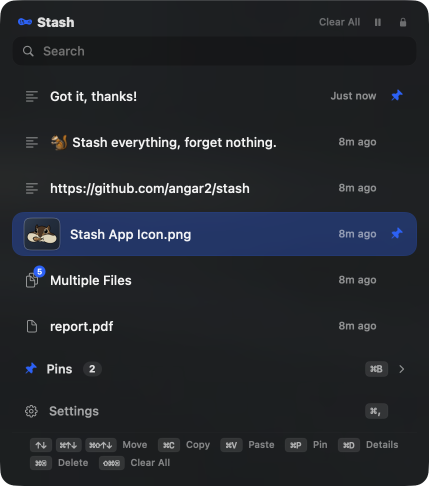

# Stash <picture><source media="(prefers-color-scheme: dark)" srcset="docs/icons/menubar-dark.png"></picture>


[](README.ko.md)


## ☻ Hello!

**Stash** is a macOS clipboard app that tucks away your text, images, and files.  
Like a squirrel hoarding acorns, it keeps everything you copy so you never lose it — pop it right back out anytime with a single shortcut.




### <picture><source media="(prefers-color-scheme: dark)" srcset="docs/icons/menubar-dark.png"></picture> Here's what you can do

- `Auto-stash`: Anything you copy — text, images, files — piles up in your stash automatically.
- `Quick access`: Pull up your stash with a shortcut while typing, without breaking your flow.
- `Fast search`: Got a lot stashed? Search by keyword and find it in a snap.
- `Grab several at once`: Pick multiple items and paste them in one go — text gets joined together, files and images come over as a batch.
- `Pin it`: Pin the stuff you use often. Give it a name, and paste it anytime with a shortcut.
- `Detailed info`: See where each item was copied from, when, character count, image previews, and more.
- `Flexible layout`: Resize and move the stash window however you like — keep it open all the time if you want.


### <picture><source media="(prefers-color-scheme: dark)" srcset="docs/icons/menubar-dark.png"></picture> When it comes in handy

- Worried your latest copy might disappear, so you paste it into Notes just in case? ⮕ `Just keep copying — it's all saved in your stash.`
- Tired of retyping the same phrases in messages? ⮕ `Look it up in your stash. Search works too.`
- Digging through folders for that meme image again? ⮕ `Copy it once, pin it, done.`
- Copy-pasting back and forth across multiple windows? ⮕ `Just copy it all at once, then paste it all at once.`
- Want to peek at an image you copied? ⮕ `Preview it right from your stash.`
- Need to count characters? ⮕ `Your stash shows the character count for any text you copied.`


## ☻ Getting Started

### <picture><source media="(prefers-color-scheme: dark)" srcset="docs/icons/menubar-dark.png"></picture> How do I install it?

1. Download `Stash.dmg` from the [GitHub Releases](https://github.com/angar2/stash/releases) page.
2. Open the .dmg and drag Stash.app into your `Applications` folder.

For detailed installation notes, see the description on the Releases page above.


### <picture><source media="(prefers-color-scheme: dark)" srcset="docs/icons/menubar-dark.png"></picture> How do I update it?

Once installed, Stash lets you know on its own. When a new version is out, a notice appears at the top of your stash — click it and the download and install happen for you. No need to go fetch it yourself.

- Want to check right now? — **Check for Updates** in the `About` tab of Settings
- Rather not be notified? — turn off **Check for Updates Automatically** in the `General` tab (you can still check manually from the `About` tab)

> If you're on a version from before this feature, install manually one last time using the steps above. From then on, Stash will tell you.


### <picture><source media="(prefers-color-scheme: dark)" srcset="docs/icons/menubar-dark.png"></picture> How do I use it?

Once you launch the app, the Stash acorn icon ( <picture><source media="(prefers-color-scheme: dark)" srcset="docs/icons/menubar-dark.png"></picture> ) shows up in your menu bar. Click it or hit your shortcut to open the stash.

First, just copy things like you normally would.

| Action | Shortcut |
|--------|----------|
| Open stash | `⇧⌘C` |
| Navigate items | `↑↓` or `⌘ ↑↓` or `⇧⌘ ↑↓` |
| Paste right away | `⌘V` |
| Just copy | `⌘C` |
| Select multiple | `⌥C` or `⌥`-click |
| Pin an item | `⌘P` |
| Paste a pinned item | `⌥⌘1` – `⌥⌘0` |
| Delete | `⌘⌫` or `⌥⌘⌫` |

All shortcuts are customizable, and you can use mouse clicks too.
Pin paste shortcuts (`⌥⌘1` – `⌥⌘0`) work anywhere — no need to open the stash first.
With multiple items selected, copying and pasting work on the whole batch, in the order you picked them. The joining character is configurable in Settings.


## ☻ Good to Know

### <picture><source media="(prefers-color-scheme: dark)" srcset="docs/icons/menubar-dark.png"></picture> Is it safe?

Yes — Stash never sends your data anywhere.

- **Local only** — No external server calls. Works the same whether you're online or offline.
- **Sensitive data auto-blocked** — Anything copied from password managers like 1Password or Bitwarden is automatically skipped. Stash detects the system markers these apps attach to the clipboard and filters them out.
- **Ignore specific apps** — Don't want copies from certain apps collected? Add them to the ignore list in `⛯` settings.
- **Where data lives** — Everything is stored in a local folder you choose. Need a backup? Just copy that folder.


### <picture><source media="(prefers-color-scheme: dark)" srcset="docs/icons/menubar-dark.png"></picture> How do I remove it?

To completely remove the app, run the [`uninstall.sh`](uninstall.sh) script directly in your terminal, or use the command below.

```sh
curl -fsSL https://raw.githubusercontent.com/angar2/stash/main/uninstall.sh | bash
```

> ⚠ If another app is also named 'Stash', its crash reports may be removed as well.


### <picture><source media="(prefers-color-scheme: dark)" srcset="docs/icons/menubar-dark.png"></picture> Let me know!

Found something weird, broken, or a feature you wish Stash had? Drop it on [GitHub Issues](https://github.com/angar2/stash/issues) — no formality needed.

Bug reports get fixed faster with these details:

- macOS version (Sonoma 14 / Sequoia 15 / Tahoe 26)
- Stash version
- What you did and what went wrong


## License

MIT License. See the [LICENSE](LICENSE) file for details.
